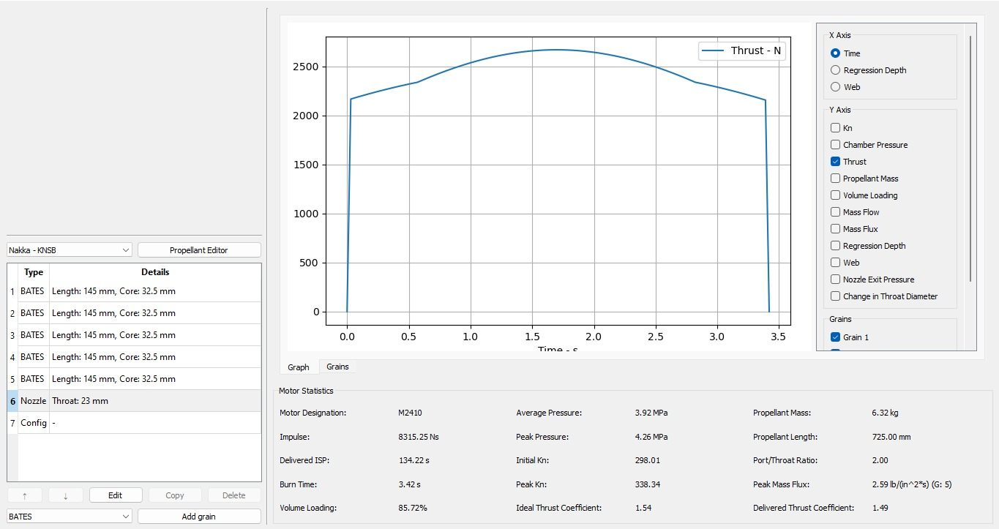

# N4 rocket portal

## Specification

| Rocket | N-4   (Names TBD) |
| --- | --- |
| Airframe material | Fibreglass |
| Length | 254 cm |
| External diameter | 109 mm |
| Dry mass | 13.1 kg |
| Total mass | 25.8 kg |
| Simulated apogee | 3,540 m |
| Propellant | KNSB |
| Simulated total impulse | 8,315 \[N•s\] (M2410 motor) |

## General information

| Component         | Link  | 
|---|---|
| Rocket measured data | |
| Rocket photos | |

## Airframe
| Component         | Link  | 
|---|---|
| OpenRocket simulation file |   |
| Airframe CAD data   |   |
| 3D Print data (Nose cone, launch lugs)| |
| Avionics bay design data | |
| Parachute design data | |
| Fin design data | |

## Recovery
| Component         | Link  | 
|---|---|
| Flight computer PCB design (Wifi-based. 3 of 4 N-3 rockets use this design) |  |
| Flight computer PCB design (LoRa-based. 1 of 4 N-3 rocket uses this design) |  |
| Ejection PCB design |  |
| Flight computer firmware |   |  
| Ground station dashboard |  | 

## Propulsion

| Component         | Link  | 
|---|---|
| Solid rocket motor design calculation  | [link](https://github.com/nakujaproject/N-4_Solid_Propulsion/blob/main/SRM%20Components/Design%20Calculations.pdf)  |
| OpenMotor simulation file | [link](https://github.com/nakujaproject/N-4_Solid_Propulsion/blob/main/Grains/N4_grain%20design.ric) |  
| Casing CAD data  | [link](https://github.com/nakujaproject/N-4_Solid_Propulsion/blob/main/SRM%20Components/Casing.SLDPRT)  |  
| Casing drawing  | [link](https://github.com/nakujaproject/N-4_Solid_Propulsion/blob/main/SRM%20Components/Bulkhead_Drawing.pdf)|
| Nozzle CAD data  | [link](https://github.com/nakujaproject/N-4_Solid_Propulsion/blob/main/SRM%20Components/Nozzle2.SLDPRT) |  
| Nozzle drawing (No mounting holes)  | [link](https://github.com/nakujaproject/N-4_Solid_Propulsion/blob/main/SRM%20Components/Nozzle2_Drawing_redesigned.PDF)  |  
| Bulkhead CAD data |  [link](https://github.com/nakujaproject/N-4_Solid_Propulsion/blob/main/SRM%20Components/Bulkhead.SLDPRT) |  
| Bulkhead drawing (No mounting holes) | [link](https://github.com/nakujaproject/N-4_Solid_Propulsion/blob/main/SRM%20Components/Bulkhead_Drawing.pdf)|
| SRM casting video| | 

## Static test stand
| Component         | Link  | 
|---|---|
| Ignitor design | |
| Ignition circuit design data | | 
| Ignition controller PCB design data | |
| Ignition controller firmware | | 
| Static test stand design calculation |  |
| Static test stand CAD data | |

## Testing
| Component         | Link  | 
|---|---|
| Static test data| |
| Static test videos | | 
| Pop test data| |
| Pop test video| |
| Parachute test video| |
| Drone test data |  |

## Launch preparation documents
| Component         | Link  | 
|---|---|
| Launch procedure | |
| Dry run | |
| Participants list || 

## Launch data
| Component         | Link  | 
|---|---|
| Sensor telemetry data | |
| Video from onboard camera  | |
| Photos for launch | |

